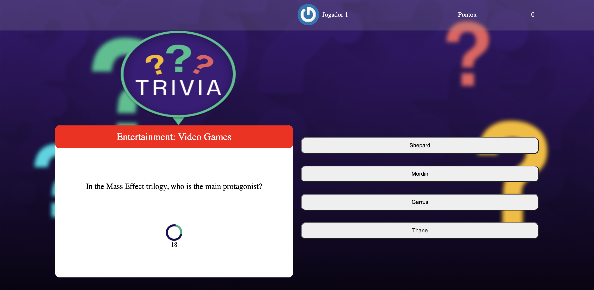

# Trivia Game

## Introduction

The Trivia Game was created in a group and utilizes an external API to provide questions and answers. It offers an interactive experience where users can test their knowledge in a fun environment of questions and answers.

To start playing, users need to log in to the game using an email and a name. The game consists of 5 questions, each with a 30-second time limit for a response. If the player doesn't answer within the stipulated time, they won't receive points for that question.

At the end of the 5 questions, players are redirected to the score screen, where they can view their placement in the local ranking. **It's important to note that due to the use of an external API, there might be occurrences of questions with incorrect formatting.**

## Key Features

### 1. Use of External API
The game integrates with an external API to provide a variety of questions and answers, ensuring a wide range of challenges for players.

### 2. Gameplay Mechanics
With a 30-second time limit per question, the game challenges users to respond quickly, encouraging quick decision-making and rapid knowledge recall.

### 3. Scoring and Ranking System
After answering the 5 questions, players are directed to the score screen, where they can view their position in the local ranking and compare their scores with other players.

## Prerequisites

Before running this project, ensure you have the following dependencies installed:

- [Node.js](https://nodejs.org/) and [npm](https://www.npmjs.com/) for server execution and package management.

## How to Run

1. Clone this repository.
2. Install dependencies: `npm install`.
3. Start the server: `npm start`.
